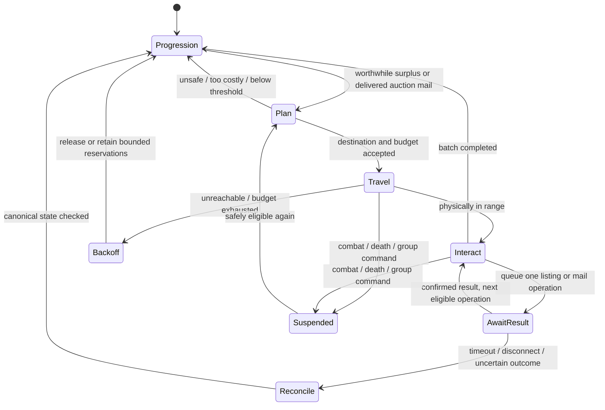

# Playerbot auction selling implementation plan

Date: 2026-10-02. Status: proposed; no feature code implemented or enabled.

Read with the adjacent REQUIREMENTS and ANALYSIS documents. Existing inspected
branches are `persistent-bots-ah-20261002` in the three source repositories.
New class/file/config names below are proposals, not existing interfaces.

## 1. Behavior and release boundary

Make commerce an occasional purposeful town errand in the active NewRpg system.
A bot notices surplus, compares local vending with auctioning, checks whether a
safe trip is worthwhile, visits an auctioneer, and resumes progression. Delivered
auction mail creates a later mailbox errand. Combine repair and junk-selling
stops when compatible with the route; each need remains an independent action.

First release covers ungrouped autonomous bots, faction houses, earned ordinary
loot and gathering goods. Favor naturally accumulated low-level materials and
useful surplus gear; do not force every bot to contribute a listing. The feature
has no fixed item-ID allowlist. Template metadata, existing item-usage rules,
actual item-instance restrictions, provenance and market conditions govern it.

Do not implement neutral-market speculation, autonomous buying, crafting demand
planning or universal mail handling in this release. These are separate features.

## 2. Components and repository changes

| Component | Proposed location / existing integration | Responsibility |
| --- | --- | --- |
| Surplus policy and cached plan | New values under `src/Ai/Base/Value/`; `ItemUsageValue.cpp`, value context | Protected reserves, proven earned quantities, actual instance eligibility, scored candidates; cached reads in triggers. |
| Vendor cooperation | `src/Ai/Base/Actions/SellAction.cpp` | Preserve only selected reserved candidates while enabled; release reservations on abandonment, age limits or emergency bag pressure. |
| Commerce errand state | `src/Ai/World/Rpg/NewRpgInfo.h`, NewRpg status update/actions/strategy | One active purpose and destination, interruption/resume, travel budget, return to progression. |
| Destination selection | `src/Mgr/Travel/` and existing flight/movement managers | Friendly faction house/mailbox, accessible approach, safe route cost, reachability backoff. |
| Listing and mail actions | New focused actions under `src/Ai/Base/Actions/`; action/trigger contexts | Validate usefulness and interaction range, then enqueue one mutation. |
| World operations | New operations under `src/Script/WorldThr/` | Resolve GUIDs on execution; use native listing/mail handlers; publish immutable outcomes to AI. |
| Market and lifecycle service | New manager under `src/Mgr/`; auction and inventory script hooks | Bounded market snapshots, provenance, operation deduplication, settlement tracking and recovery. |
| Auction-mail protection | `CheckMailAction.cpp`, relevant mail action paths | Explicit mail-type guard; prevent generic correspondence processing from consuming auction settlement. |
| Configuration and persistence | `PlayerbotAIConfig`, `conf/playerbots.conf.dist`, dated module SQL updates | Load configuration once; store advisory ledger/state and expose counters. |
| Economy cooperation | `mod-ah-bot-plus` stock generation and buyer selection | Distinguish humans, earned bot supply and filler; reduce filler deficits; aggregate cohort spending cap. |

Keep mod-playerbots usable without mod-ah-bot-plus. Its market summary can read
native auction state and events independently. If companion-module accounting
needs a shared interface, design a small optional owner-role/supply interface
after reviewing the actual hook API. Do not introduce a hard include dependency
or duplicate identity queries in both modules. Core changes are not assumed;
add a minimal hook only if existing packet/hook handling cannot confirm results.

## 3. Surplus, provenance and reservation

Build a cached inventory plan following an inventory change or a staggered
refresh. Triggers inspect flags and next-eligible timestamps in O(1); they do
not scan bags, auctions or SQL every tick.

Evaluate each actual item instance, not just an item template:

1. Apply existing use/keep classifications for equipment upgrades, quests,
   guild tasks, profession stock, consumables, tools, ammunition and
   disenchanting. Existing protected use takes precedence over sale value.
2. Reject bound, nontradeable, timed, conjured, nonempty container or otherwise
   core-ineligible instances. Revalidate all of this again at execution.
3. Bound eligible quantity by proven earned surplus. Loot/gather acquisition
   events add eligible quantities; factory generation, gearing/reset, mail,
   trades and auction buying do not. Existing inventory without provenance is
   conservatively left in its normal use/vendor flow.
4. Compare local vendor value with a conservative expected auction return.
5. Reserve a small set of profitable candidates, with a maximum age and count.
   Do not reserve all items classified `ITEM_USAGE_AH`.

Provenance tracks acquired quantities and item variants, with allocations to
current GUIDs. Stack merges/splits and partial sale must not inflate eligible
quantity. Equipment tracks actual GUID and random properties. Inventory is the
hard upper bound; uncertain provenance reduces eligible quantity. A lost journal
entry may cause under-listing, never justify spawning an item or increasing stock.

Reservation is a selling policy, not inventory escrow. Other legitimate uses can
invalidate a reservation; refresh it afterward. At severe bag pressure, release
the lowest-value auction candidate for normal vending if the next safe AH visit
is too far away. Do not sell protected items to make room for auction returns.

## 4. Prices, deposits and choice of market

Publish immutable per-house summaries from bounded world-thread maintenance.
Use unit prices, stack size, item variant and owner role. Ignore invalid prices,
self-generated feedback and extreme outliers. Track sale source: a synthetic
buyer purchase is weaker evidence of human demand than a human purchase.
Ordinary listings alone are asking prices, not proof of realized demand.

Estimate:

`expected AH proceeds = sale probability * (price - house cut)
                       - failure probability * deposit
                       - allocated travel cost`

Compare this with immediate vendor proceeds and a minimum benefit margin.
Successful native settlement returns the deposit, so do not subtract it as a
permanent cost from every successful sale. Reserve cash up front for deposits,
repair and near-term training; use native deposit computation and actual house
fees rather than a duplicate formula.

Start with capped historical sales and a robust median of comparable listings.
Sparse markets use conservative vendor-relative price bounds; weak evidence
can reject a dedicated trip while allowing posting during an existing town visit.
Do not repeatedly cancel auctions to undercut. Initially post only whole existing
stacks that are entirely surplus, plus one-item equipment listings, in small
batches. Prefer useful stack sizes when already available. Partial protected
stacks remain unposted until stack preparation and crash behavior are validated.

Score valid faction destinations using route time, safety, available flights,
fees, demand evidence and useful repair/mail stops. A farther capital must offer
enough benefit to justify its route. Respect the server's configured merged or
cross-faction house behavior: compare actual economic pools, not city labels.
Neutral houses remain disabled initially. Low-level bots with no affordable safe
route should vendor or wait, rather than make forced capital expeditions.

## 5. Errand lifecycle and movement

Pending settlement is durable lifecycle data, separate from the movement state.
A completed trip does not wait in town for a 12-hour auction to expire.

Integrate the errand as a NewRpg state/purpose so its central status updater does
not replace the commerce destination with grinding on the next tick. Reuse
existing movement/flight behaviors and named action relevance bands. Do not add
a competing high-priority strategy that overrides combat or player commands.

The trip has an elapsed active-time budget and checks whether enough session
time remains for the estimated route plus a margin. Session rotation can still
interrupt; preserve purpose and re-evaluate on next login, without extending
offline progression beyond its existing safety stop. Stagger starts with jitter
and cap simultaneous traveling sellers per faction.

Validate destinations against terrain/navmesh and friendly NPC/object flags.
Observed invalid-height destinations need a regression case and either a shared
route fix or safe rejection for commerce. Routine travel uses walking/flights.
If existing unstuck recovery is invoked, validate its destination and record it;
do not count teleport recovery as successful ordinary travel. Retry/backoff is
bounded, and repeating the same failed destination releases the errand.

## 6. Native mutations and reliable completion

Map-thread AI enqueues immutable identifiers and parameters through
`PlayerbotWorldThreadProcessor`; it never carries live Player/Item pointers across
ticks. Use one outstanding commerce mutation per bot, a request token, login
generation and deadline. Queue admission failure is a retryable result, not success.

On the world thread, re-resolve the player and target, confirm login generation,
eligibility, range, bag/item/count, money and spending reserve. Construct the
normal listing packet with the exact owned GUIDs/counts, price and legal duration,
then use `HandleAuctionSellItem`. Native code controls inventory movement, deposit,
auction ownership and database transaction. Do not reactivate the commented old
LootAction auction routine or create a replacement item.

The inspected native partial/multi-stack branch uses separate transactions for
some source-stack deletion before saving the resulting auction. Therefore the
first release submits a single whole existing stack per listing, using the
simpler native branch. This is a deliberate accounting boundary, not a claim
that arbitrary native stack aggregation is atomic. Enabling partial-stack
posting requires a separate transaction audit and interruption tests; do not
work around it by inventing replacement inventory in the module.

Confirm outcomes using the native command result plus ownership/inventory state
and available auction hooks. Some invalid-range paths can return without a
normal success/error packet, so timeout must mean reconcile, not automatic retry.
Auction-add hooks must not be treated as proof of durable DB success without
checking native transaction semantics. A failed or uncertain operation receives
a reason code and canonical-state check before another mutation is allowed.

If logout occurs before execution, cancel the pending operation. If it occurs
after mutation, recover from the auction/mail/inventory records. Do not queue a
second listing while the first result is unresolved, and do not issue a mail-take
twice without rechecking the current mail contents.

## 7. Auction mail and expiry policy

Detect delivered, owned auction mail independently of generic player mail.
Before starting a trip, summarize whether collectable money or items justify it;
at the mailbox, recheck delivery time, type, ownership and normal interaction.

Collect money independently of bag space. For returned goods, check actual
capacity for the specific attachments, take what safely fits, and leave the
remainder. Confirm each native operation before advancing. Delete only mail
confirmed to have no remaining money or attachments and no lifecycle purpose.
Do not process COD, player or guild correspondence through this feature.

The existing generic check-mail trigger is commented out; its action nevertheless
needs an explicit auction-mail exclusion before new autonomous behavior is added.
Do not simply enable that trigger or reuse its sender-as-player logic.

An expired lot may be relisted once, after another value/reserve check and a
modest bounded price adjustment. After the second expiry, return it to current
use/vendor policy. Restart, merging stacks or changing item GUID cannot reset
this counter. No automatic cancellation of healthy auctions for repricing.

## 8. Persistence and reconciliation

Propose dated, idempotent migrations in `data/sql/playerbots/updates/`:

- Commerce lot: bot GUID, lot ID, item/variant identity, proven earned quantity,
  current allocation, first-seen time, expiry count, disposition and linked
  auction ID when known.
- Commerce operation/errand: bot GUID, request token, login generation, purpose,
  destination reference, intended item/count/price, status, last attempt,
  cooldown and last result. Persist useful intent, not raw pointers or paths.

Keep this journal small and advisory. Core character inventory, auctions and
mail are authoritative; the module database and core character database do not
share an assumed atomic transaction. Do not promise exactly-once distributed
commits. Persist intent/outcome asynchronously and reconcile incomplete entries
on login/startup against canonical records. Fail conservatively on uncertainty.

Recovery cases: item remains owned means listing did not finish; owned auction
means do not repost; sale/return mail means settle; missing stock with uncertain
history means quarantine the lot from new selling until resolved. Money-taking
retries read remaining native mail money, never re-credit a journal amount.
Clean completed history on a bounded retention schedule without discarding active
or unresolved records. Enforce unique active request tokens and schema versioning.

## 9. Coordination with the existing AH economy

Track human listings, proven earned cohort listings and generated filler as
separate owner roles. Classification uses cached cohort identity; no per-auction
SQL or inference from character names. Human activity remains unrestricted.

Treat the existing 1,700–2,500 combined target as the synthetic baseline and
reference supply budget, not a hard limit on human auctions. In each house and
progression/category bucket, subtract comparable earned supply from the filler
deficit. Example: if a bucket targets 100 generated listings and contains 25
eligible earned listings, request roughly 75 filler listings at the next refill.
Use smoothing and duplicate limits; do not evict humans or cancel earned auctions
to maintain the target, and let excess existing filler expire normally.

The current synthetic buyer can consider ordinary cohort owners, unlike its
configured AH characters. Add a rolling aggregate spend budget for the whole
cohort as well as per-owner/item/category guards. Initial cohort cap should be
the smaller of an explicit configured limit and 10% of the normal buyer spending
budget over the same window. Verify how the existing buyer defines that window
before implementing the ratio; do not assume a per-seller setting is an
aggregate budget. Preserve native affordability, delay and price checks.

Synthetic purchases must be labeled in metrics and demand estimation. No bot
buys its own auctions, and acquired auction goods cannot become eligible earned
stock. Roll out filler/buyer safeguards before enabling ordinary bot listings.

## 10. Proposed pilot defaults

These are starting values to tune using observations, not installed settings.
Document configuration in the module distribution file and load it once.

| Setting | Proposed first value / behavior |
| --- | --- |
| New selling | Off by default; selected autonomous cohort when enabled. |
| Pilot population | 4 bots, then 20, then 80 after acceptance. |
| Active listings | Maximum 5 per bot. |
| Batch size | Maximum 3 new listings per visit. |
| Duration | Native 12-hour duration; validate actual core configuration. |
| Relisting | At most 1 relist after expiry. |
| Trip cooldown | 60 minutes of eligible online time, staggered; mail can combine with other town needs. |
| Travel budget | At most 10 active minutes per round trip; estimate before departure. |
| Simultaneous dedicated trips | Maximum 2 per faction during pilot. |
| Inventory refresh | Event invalidation plus staggered 60-second refresh; no per-tick scan. |
| Market snapshot | Staggered 60-second refresh, incremental hooks and bounded maintenance slices. |
| Cash reserve | Estimated immediate repair/training needs plus buffer; deposits also capped to 10% of available cash after reserve. |
| Reservation age | 2 hours of eligible online time, then re-evaluate or release. |
| Emergency bag threshold | 90% occupied; release unprotected low-value reservations if safe AH access is unavailable. |
| Neutral houses | Disabled initially. |
| Synthetic cohort buying | Aggregate cap, initially at most 10% of normal buyer budget in the same window. |

Avoid exposing dozens of tuning knobs initially: expose enable/cohort scope,
limits, duration, travel budget and economic integration controls; keep policy
constants documented until measurements justify extra configuration. Choose the
profit threshold from real copper-level loot/deposit samples so poor level-3 bots
are not forced into trips or priced out of ever participating.

## 11. Implementation sequence and release gates

| Step | Deliverable | Gate before moving on |
| --- | --- | --- |
| 1. Interfaces and policy | Earned-lot tracking, cached surplus/valuation, disabled-by-default config, reason-coded dry-run decisions. | Protected inventory never selected; merges/splits cannot inflate stock; projected deposits and vendor comparisons match native examples. |
| 2. Economy safeguards | Cached owner roles, earned-supply-aware filler, aggregate synthetic buyer budget. | Adding 80 owner GUIDs does not multiply spend; human auctions unaffected; module standalone behavior works. |
| 3. Native transaction and mail lifecycle | World operations, confirmation/reconciliation, journal, auction-mail exclusions and expiry policy. | Rejection, ambiguous result, full bags, logout and restart preserve exact items/money; no fake success logging. |
| 4. Town behavior | NewRpg errand, faction destinations, mailbox interaction, interruption/backoff. | Real movement and range checks, invalid-height/unreachable regression, bounded travel and resumption. |
| 5. Four-bot pilot | Enable selected bots with small limits; observe at least one full auction expiry/relist cycle. | Earned auctions, native deposits, sale proceeds and returned goods observed; healthy server and progression. |
| 6. Expansion | Twenty, then eighty bots; tune limits using recorded outcomes. | No concentrated travel storm, excessive gold injection or persistent progression slowdown. |

Steps 3 and 4 may be developed together, but do not enable posting before both
are complete. Persistence/recovery is a prerequisite for the first live pilot,
not a follow-up after successful happy-path selling. Split commits by policy,
transaction/lifecycle, movement and companion economy integration; keep paired
branch versions documented. Build/deploy only when separately requested.

## 12. Verification, observability and rollback

Use focused tests for economic and preservation invariants, not tests that merely
mirror the state machine. Cover protected reserves, quantity conservation across
merge/split, price/deposit calculations, expiry cap, buyer aggregate limits and
provenance exclusion. Use runtime integration checks for native transactions,
mail delivery, movement and interruption, where pure mocks would miss core behavior.

Integration scenarios include insufficient deposit cash; stale item GUID;
out-of-range/dead auctioneer; queue full; disconnect before/after execution;
restart between native transaction and journal update; full bags with money mail;
partial attachment collection; unknown/COD mail; death/group command mid-route;
session rotation and invalid terrain. Feature-off verification must include the
existing vendor path and settlement of auctions created before disabling.

Record bot/lot/request/auction IDs and concise reason codes for decisions and
outcomes. Aggregate inventory eligibility, new listings, human/synthetic sales,
expiry/return counts, deposit loss, realized net revenue, vendor fallbacks,
route minutes, failed destinations, pending operation age and progression
experience per active hour. Distinguish attempted, confirmed and reconciled results.
Bound logs; expose summaries rather than per-tick spam.

Measure market maintenance cost and queue latency against the same cohort baseline.
Suggested pilot stop conditions: any protected-item sale or duplicate credit;
unresolved mutation exceeding its reconciliation deadline; repeated unsafe route;
buyer budget breach; or more than 10% deterioration in progression per active
hour over comparable windows. The performance threshold is a proposed gate,
not a claim about current measurements. Interpret travel share and cohort variance
before raising participation. A 12-hour listing plus one relist needs at least
24 hours and mail-delivery time to exercise the complete expiry path.

Rollback disables new reservations, trips and listings, releases unposted
reservations, and retains reconciliation plus safe mailbox settlement for existing
auctions. Do not delete owned auctions, refund invented journal amounts or discard
their return mail. If the companion accounting is disabled, cap or pause synthetic
buying of cohort stock until its accounting is restored.

## 13. Main uncertainties to resolve during implementation

- Confirm usable outbound packet/result hooks and the native auction transaction
  commit boundary; add minimal core instrumentation only if required.
- Identify acquisition/inventory hooks that reliably track ordinary loot,
  gathering, merge/split and factory generation in this checkout.
- Choose a dependency-free owner-role interface supported by the current script
  API; otherwise implement a small explicit paired integration contract.
- Measure available buyer budgets and poor-bot deposit/training needs before
  choosing monetary thresholds.
- Validate route estimates and existing stuck recovery against the observed
  Durotar bad-height cases.

These are implementation investigations with defined safe fallbacks. They do not
require expanding the release into gathering, arbitrary mailbox processing or
a replacement auction engine.
